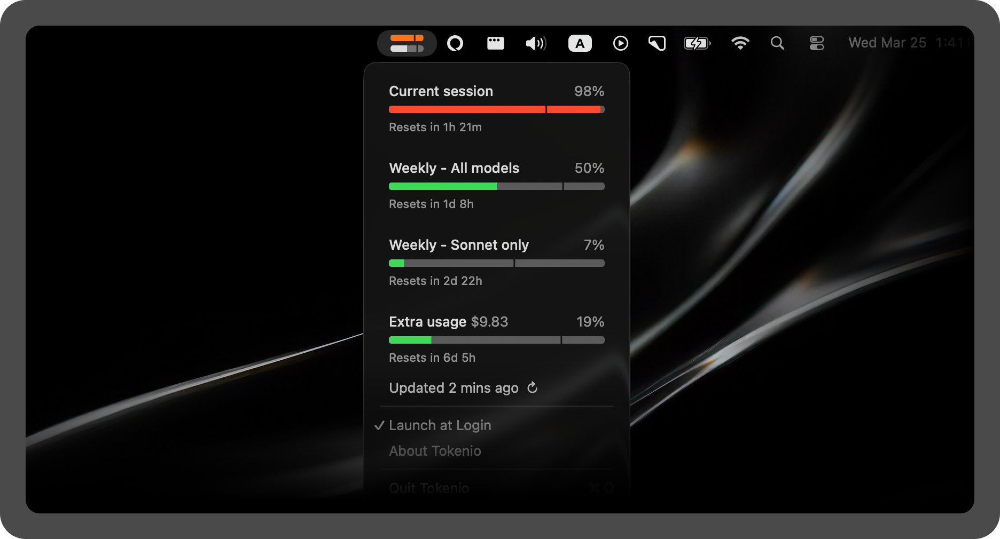

# Claudio

Tiny macOS menu bar app that shows your Claude AI usage at a glance.



## What it shows

- **Current session** (5-hour window) — usage % with pace indicator
- **Weekly — All models** (7-day window)
- **Weekly — Sonnet only** (7-day window)
- **Extra usage** — dollar amount and utilization

Each bar is color-coded: **green** = normal, **orange** = near limit (≥90%), **red** = at limit. The transparent notch shows where you are in the time window.

The menu bar icon shows two small bars: the top bar is your current session usage, and the bottom bar is your weekly usage.

## Install

Download the latest `.zip` from [Releases](https://github.com/miloguastamacchia-source/claudio/releases), unzip, and drag `Claudio.app` to your Applications folder.

Requires macOS 13 (Ventura) or later. Designed for Claude Pro and Max subscribers.

Claudio enables Launch at Login on first run — you can toggle this from the menu.

## Auth

On first launch, Claudio shows a welcome screen. Click **Log in to Claude** to sign in with your Claude account via email verification. Google sign-in is not supported — use "Continue with email" instead.

Your session is stored locally and persists across restarts. No keychain prompts, no CLI required.

## Build from source

```bash
git clone https://github.com/miloguastamacchia-source/claudio.git
cd claudio
xcodebuild -project Claudio.xcodeproj -scheme Claudio -configuration Release -derivedDataPath build build
```

The built app will be in `build/Build/Products/Release/Claudio.app`.

## How it works

Claudio signs you in via claude.ai and stores a session key locally. It then fetches usage data from Claude's API every 5 minutes. The API is undocumented and may change without notice.

Usage data is only exchanged with `claude.ai`. Your session key is stored in your macOS keychain under Claudio's own entry — no credentials leave your machine.

## Known limitations

- Relies on Claude's internal API, which may break when Anthropic changes it.
- Google sign-in is not supported — use email verification instead.
- If you belong to multiple organizations, usage shown is for your primary account.

## License

Copyright (c) 2026 Milo Guastamacchia. All rights reserved.
